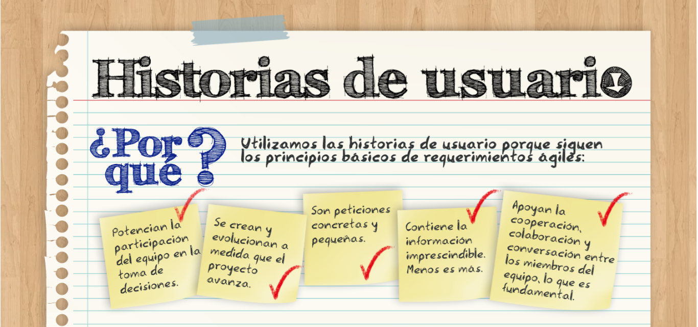

# Arquitectura de software

## 1 - Requerimientos
  - Publicar anuncios de mascotas en adopción
  - Visualizar las mascotas que están en adopción
  - Permitir a los usuarios interesados en adoptar registrarse y poder enviar solicitudes de adopción
  - Permitir a los cuidadores evaluar solicitudes y confirmar una adopción

## 2 - Historias de usuario

  ### Estructura
  - "Como [rol de usuario] quiero [objetivo] para [beneficio]"
  ### Ejemplo
  - Como usuario quiero ver a todas las mascotas en adopción para elegir la que me guste

## 3 - Criterios de aceptación

## 4 - Diagrama Entidad Relación	

## 5 - Modelo E-R	

## 6 - mockup design o wireframes

## Reto 2
  - Escribe mínimo 3 historias de usuario para definir los requerimientos de su proyecto.

  

## Ejemplos
  https://docs.google.com/spreadsheets/d/1vQcKMmqFIEWCubazpIUB2Oelx0R6bTcqiDPKy2RG7dI/edit?usp=sharing

  ## Crear diagramas
  draw.io